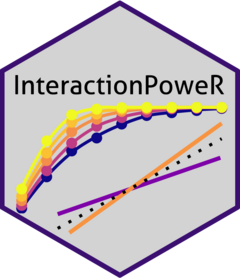

<!-- README.md is generated from README.Rmd. Please edit that file -->

# InteractionPoweR <a href='https://dbaranger.github.io/InteractionPoweR/'></a>

<!-- badges: start -->

[](https://CRAN.R-project.org/package=InteractionPoweR)
[](https://cran.r-project.org/package=InteractionPoweR)

<!-- badges: end -->

The `{InteractionPoweR}` package conducts power analyses for regression
models in cross-sectional data sets where the term of interest is an
interaction between two variables, also known as ‘moderation’ analyses.
The package includes functions for simulating data sets, conducting
power analyses, and plotting and interpreting results. Notable package
features include (1) the ability to compute power for interactions
between two continuous variables, (2) effect sizes are all specified as
the cross-sectional Pearson’s correlation, (3) simulations do not assume
that the interacting variables are independent, (4) any variable in the
model, including the outcome, can have anywhere from 2 (i.e., binary) to
20 discrete values, and (5) analyses can incorporate the effects of
reliability, both of the interacting variables, as well as of the
outcome variable.

**For more information see our [tutorial
paper](https://doi.org/10.31234/osf.io/5ptd7), the package
[vignette](https://dbaranger.github.io/InteractionPoweR/articles/articles/InteractionPoweRvignette.html),
and the
[FAQ](https://dbaranger.github.io/InteractionPoweR/articles/articles/CommonQuestions.html).**

We have a [**Shiny
app**](https://mfinsaas.shinyapps.io/InteractionPoweR/) which implements
the major functions for simulation-based power analyses in a
user-friendly point-and-click interface. We also have a [**simpler Shiny
app**](https://david-baranger.shinyapps.io/InteractionPoweR_analytic/)
for computing analytic power. We recommend this app particularly for
beginners and users who are new to power analyses.

Please report bugs, issues, or questions as an [Issue on
Github](https://github.com/dbaranger/InteractionPoweR/issues/).

## Installation

You can install InteractionPoweR from CRAN with:

``` r
install.packages("InteractionPoweR")
```

You can also install the development version of InteractionPoweR from
github with:

``` r
install.packages("devtools")
devtools::install_github("dbaranger/InteractionPoweR/")
```

If you get an error about a corrupt .rdb file, try restarting your R
session.

## Basic Usage

The simplest use-case is when all the input parameters are known. We
know the population-level correlation between our predictors (x1 and x2)
and our outcome, we have a smallest effect size of interest in mind for
our interaction effect size, and our sample size is already set (maybe
we are conducting secondary data analysis). Power can be determined with
a single command.

First - analytic power, using variable correlations (and reliability, if
provided) to estimate how much additional variance is explained by the
interaction term.

``` r
library(InteractionPoweR)

test_power<-power_interaction_r2(
  alpha = 0.05,             # alpha, for the power analysis
  N = 350,                  # sample size
  r.x1x2.y = .15,           # interaction effect to test (correlation between x1*x2 and y)
  r.x1.y = .2,              # correlation between x1 and y
  r.x2.y = .1,              # correlation between x2 and y
  r.x1.x2 = .2              # correlation between x1 and x2
)

test_power
#>         pwr
#> 1 0.8055776
```

We see that we have 80% power.

We can also use simulations to estimate power. Simulations are
particularly useful because they can account for non-normal data,
including binary and likert variables.

**NB** In all these examples we use 1000 simulations for speed
(`n.iter = 1000`), but for robust results we recommend 10,000
simulations (`n.iter = 10000`).

``` r
set.seed(2022)
test_power<-power_interaction(
  n.iter = 10000,            # number of simulations per unique combination of input parameters
  alpha = 0.05,             # alpha, for the power analysis
  N = 350,                  # sample size
  r.x1x2.y = .15,           # interaction effect to test (correlation between x1*x2 and y)
  r.x1.y = .2,              # correlation between x1 and y
  r.x2.y = .1,              # correlation between x2 and y  
  r.x1.x2 = .2,             # correlation between x1 and x2 
  k.y =  5,                 # y is likert
  k.x1 = 2                  # x1 is binary
)

test_power
#>     N    pwr
#> 1 350 0.8149
```

The simulation’s accuracy will increase with more iterations.

## Citation

If you use `{InteractionPoweR}` in a publication, please cite our
[tutorial paper](https://doi.org/10.31234/osf.io/5ptd7):

Baranger DAA, Finsaas MC, Goldstein BL, Vize CE, Lynam DR, Olino TM
(2022). “Tutorial: Power analyses for interaction effects in
cross-sectional regressions.” *PsyArxiv*. doi:
[10.31234/osf.io/5ptd7](https://doi.org/10.31234/osf.io/5ptd7)
