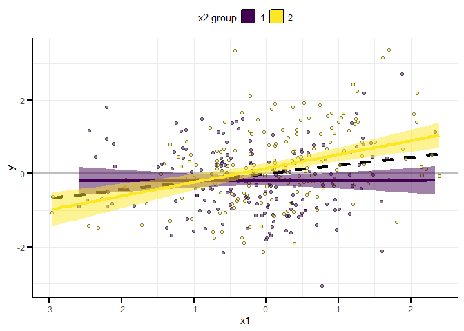
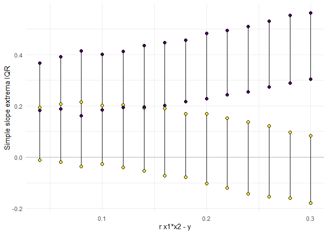
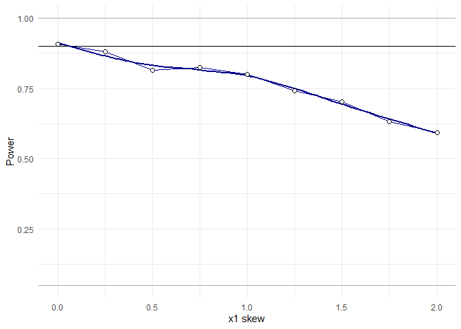

<!-- README.md is generated from README.Rmd. Please edit that file -->

# InteractionPoweR

<!-- badges: start -->
<!-- badges: end -->

InteractionPoweR is an R package for running power analyses for
interactions in cross-sectional data sets between continuous and/or
binary variables (also known as a moderation analysis). The main
function is `power_interaction()`, which performs the power analysis.
This is done via Monte Carlo simulation. `power_estimate()` helps to
interpret the results of the power simulation, and `plot_power_curve()`
and `plot_simple_slope()` generate plots to visualize the results. The
function `generate_interaction()` simulates a single data set drawn from
the specified population-level effects and `plot_interaction()` can be
used to visualize the simulated data.

## Installation

You can install InteractionPoweR from github with:

``` r
install.packages("devtools")
devtools::install_github("dbaranger/InteractionPoweR")
```

Sometimes there will be a minor installation error, which can be
resolved by using:

``` r
install.packages("devtools")
devtools::install_github("dbaranger/InteractionPoweR/@HEAD")
```

## Examples

### Example 1

The simplest use-case is when all the input parameters are known. We
know the population-level correlation between our predictors (x1 and x2)
and our outcome, we have a smallest effect size of interest in mind for
our interaction effect size, and our sample size is already set (maybe
we are conducting secondary data analysis). Power can be determined with
a single command:

``` r
library(InteractionPoweR)
library(tictoc)
tic()
test_power<-power_interaction(
  n.iter = 1000,            # number of simulations per unique combination of input parameters
  alpha = 0.05,             # alpha, for the power analysis
  N = 350,                  # sample size
  r.x1x2.y = .15,           # interaction effect to test (correlation between x1*x2 and y)
  r.x1.y = .2,              # correlation between x1 and y
  r.x2.y = .1,              # correlation between x2 and y
  r.x1.x2 = .2              # correlation between x1 and x2
)
#> [1] "Checking for errors in inputs..."
#> [1] "Performing 1000 simulations"
toc()
#> 17.71 sec elapsed
test_power
#> # A tibble: 1,000 x 4
#> # Groups:   x1x2_r2, x1x2_95confint_25 [1,000]
#>     x1x2_r2 x1x2_95confint_25 x1x2_95confint_975   pwr
#>       <dbl>             <dbl>              <dbl> <dbl>
#>  1 -0.00278           -0.114              0.0991     0
#>  2 -0.00277           -0.101              0.114      0
#>  3 -0.00271           -0.106              0.118      0
#>  4 -0.00268           -0.102              0.111      0
#>  5 -0.00246           -0.0868             0.121      0
#>  6 -0.00235           -0.0843             0.124      0
#>  7 -0.00215           -0.117              0.0715     0
#>  8 -0.00204           -0.0740             0.127      0
#>  9 -0.00196           -0.132              0.0779     0
#> 10 -0.00175           -0.0765             0.146      0
#> # ... with 990 more rows
```

We see that we have \~80% power to detect the effect of interest.

It can be hard to know what interaction correlations mean in terms of
how the data will look. To help users interpret interaction effects, we
provide a simple interface for simulating single data sets and plotting
them.

``` r
set.seed(2020)
sample_data<-generate_interaction(N=350,r.x1x2.y =.15,r.x1.y = .2, r.x2.y = .1, r.x1.x2 = .2)
plot_interaction(data = sample_data,q = 2)
```



The `test_interaction()` function can be used to see the results of the
regression `y ~ x1 + x2 + x1x2`, the correlation between the variables,
and find the simple slopes from the plot above. In this case, the ‘lower
slope’, X2 Group = 1, is roughly 0, while the ‘upper slope’, X2 Group =
2, is 0.38.

``` r
test_interaction(data = sample_data,q = 2)
#> $linear.model
#>       Estimate Std. Error  t value     Pr(>|t|)
#> x1   0.1888967 0.05153863 3.665148 2.859696e-04
#> x2   0.1356407 0.05165265 2.626016 9.022851e-03
#> x1x2 0.2129386 0.05001033 4.257892 2.661829e-05
#> 
#> $x1x2.r2
#> [1] 0.04391331
#> 
#> $x1x2.confint
#>           [,1]      [,2]
#> [1,] 0.1145761 0.3113011
#> 
#> $correlation
#>           cor v1   v2
#> 5  0.20000000 x1   x2
#> 9  0.22361262 x1    y
#> 10 0.18961691 x2    y
#> 13 0.03519020 x1 x1x2
#> 14 0.07511716 x2 x1x2
#> 15 0.23245767  y x1x2
#> 
#> $simple.slopes
#>    lower.slope upper.slope
#> x1  0.00222888   0.3766329
```

### Example 2

In this example, we know the population-level correlation between each
of our predictors (x1 and x2) and our outcome (y), as well as the
correlation between the two predictors. We are interested in
interactions within a certain range, and wish to know what sample size
we would need to detect those interactions.

``` r
library(tictoc)
tic()
  
test_power<-power_interaction(
  n.iter = 1000,            # number of simulations per unique combination of input parameters
  cl = 6,                   # number of cores for parallel processing (strongly recommended)
  alpha = 0.05,             # alpha, for the power analysis
  N = seq(20,400,by=20),    # range of sample sizes to test
  r.x1x2.y = c(.18,.2,.22), # range of interaction effects to test
  r.x1.y = .2,              # correlation between x1 and y
  r.x2.y = .1,              # correlation between x2 and y
  r.x1.x2 = .2              # correlation between x1 and x2
)
#> [1] "Checking for errors in inputs..."
#> [1] "Performing 60000 simulations"
toc()
#> 251.05 sec elapsed
```

The results of this analysis can be hard to interpret just by looking at
the output. Instead, we recommend visualizing them using
`plot_power_curve()`. In this case, the horizontal line on the plot will
be at our target power of 90%:

``` r
plot_power_curve(test_power,power_target = .9)
```


The function `power_estimate()` can be used to estimate where the
power_curve for each interaction effect size crosses our 90% line:

``` r
power_estimate(test_power,power_target = .9,x = "N")
#>   r.x1x2.y estimate
#> 1     0.18 306.2977
#> 2     0.20 244.7260
#> 3     0.22 201.1376
```

We can see that depending on the specific effect size we hope to detect,
we would need between N\~200 and N\~300 participants.

### Example 3

In this example, we know the population-level correlation between each
of our predictors (x1 and x2) and our outcome (y), as well as the
correlation between the two predictors. We know our sample size (perhaps
we are doing some secondary data analysis) and we want to know what’s
the smallest effect size we can detect. Using that information, we can
decide whether that effect would be plausible, which in turn can help
inform our decision of whether or not to run the analysis. We’ll ask for
more details on the simulations using `detailed_results=T`.

``` r
library(tictoc)
tic()

test_power<-power_interaction(
  n.iter = 1000,            # number of simulations per unique combination of input parameters
  cl = 6,                   # number of cores for parallel processing (strongly recommended)
  alpha = 0.05,             # alpha, for the power analysis
  N = 450,                  # sample size
  r.x1x2.y = seq(0.04,0.3,by=.02), # range of interaction effects to test
  r.x1.y = .2,              # correlation between x1 and y
  r.x2.y = .1,              # correlation between x2 and y
  r.x1.x2 = .2,             # correlation between x1 and x2
 detailed_results = T       # detailed results have more information on the simulations
)
#> [1] "Checking for errors in inputs..."
#> [1] "Performing 14000 simulations"
toc()
#> 88.11 sec elapsed
```

As with the previous example, the results of this analysis can be hard
to interpret just by looking at the output. With this example, we can
use the function `plot_power_curve()` to visualize the power curve.

``` r
plot_power_curve(test_power,power_target = .9)
```

 The
function `power_estimate()` can be used to estimate where the
power_curve for each interaction effect size crosses our 90% line:

``` r
power_estimate(test_power,power_target = .9,x = "r.x1x2.y")
#> [1] 0.1472064
```

We can use the function `plot_simple_slope()` to visualize the
distribution of the simple slopes (returned because
`detailed_results = T`) across the different interaction effect sizes.

``` r
plot_simple_slope(test_power)
```



From this we can see that we have 90% power to detect effects as small
as r.x1x2.y \~ .15, which is a ‘knock-out’ interaction where the
association between y and x1 is close to 0 at one end of the x2
distribution.

### Example 4

In this example, we’re going to explore how the reliability of x1 and x2
impacts our power. We know the population-level correlation between each
of our predictors (x1 and x2) and our outcome (y), as well as the
correlation between the two predictors. We know our sample size (perhaps
we are doing some secondary data analysis).

``` r
library(tictoc)
tic()

test_power<-power_interaction(
  n.iter = 1000,                  # number of simulations per unique combination of input parameters
  cl = 6,                   # number of cores for parallel processing (strongly recommended)
  alpha = 0.05,             # alpha, for the power analysis
  N = 450,                  # sample size
  r.x1x2.y = .15,           # range of interaction effects to test
  r.x1.y = .2,              # correlation between x1 and y
  r.x2.y = .1,              # correlation between x2 and y
  r.x1.x2 = .2,             # correlation between x1 and x2
  rel.x1 = seq(.4,1,.1),    # x1 reliability
  rel.x2 = seq(.4,1,.2)     # x2 reliability
)
#> [1] "Checking for errors in inputs..."
#> [1] "Performing 28000 simulations"
toc()
#> 162.2 sec elapsed
plot_power_curve(test_power,power_target = .9)
```


We can see that even with good reliability of both x1 and x2 (say x1 &
x2 reliability = .8) we have less than 80% power (74% powere here),
while a power analysis that assumes perfect reliability would estimate
that we have 90% power.

### Example 5

So far, these examples have assumed that all variables are normally
distributed. It is also possible to specify that a variable is binary
(i.e. dichotomous) and/or skewed. By default, it is assumed that the
specified correlations between all variables are the population-level
correlations of the *skewed* or *binary* variables. If this is the case,
retain the defaul setting of `adjust.correlations = T`. The ‘adjustment’
here is how much each correlation needs to be changed, so that the
resulting correlation matrix post-variable-transformation matches the
input correlation matrix. Transforming a variable typically attenuates
correlations with other variables, which can result in the analysis
confounding *skew* and decreasing effect sizes. The correlation
adjustment is run prior to the main power analysis, and depending on the
severity of the changes and size of the analysis, can be relatively
time-consuming. If, on the other hand, the correlations between
continuous normal variables is known, but in the analysis one or both
variables are artificially skewed/dichotomized, set
`adjust.correlations = F`. In the case where `y` is binary, all analyses
and plots are run as logistic regressions.

``` r
library(tictoc)
tic()

test_power<-power_interaction(
  n.iter = 1000,            # number of simulations per unique combination of input parameters
  cl = 6,                   # number of cores for parallel processing (strongly recommended)
  alpha = 0.05,             # alpha, for the power analysis
  N = 450,                  # sample size
  r.x1x2.y = .15,           #  interaction effect
  r.x1.y = .2,              # correlation between x1 and y
  r.x2.y = .1,              # correlation between x2 and y
  r.x1.x2 = .2           ,  # correlation between x1 and x2
  skew.x1 = seq(0,2,by=.25),# x1 skew
  adjust.correlations = T   # Default, adjust correlations

)
#> [1] "Checking for errors in inputs..."
#> [1] "Adjusting correlations for variable transformations..."
#> [1] "Performing 9000 simulations"
toc()
#> 76.56 sec elapsed
plot_power_curve(test_power,power_target = .9,x = "skew.x1")
```



We can see that in this example, our power decreases as the x1 skew
increases.

### Example 6

*Any* variable can be skewed and/or binary in these simulations. If a
variable is binary, the skew can be computed from the probability of 1
vs 0 using the `binary.p2skew` convenience function. Here is an example
of a single data set where all variables are binary and x2 & y are
skewed (the x1 probability of 0.5 corresponds to a skew of 0).

``` r
set.seed(2021)
sample_data<-generate_interaction(N=350,
                                  r.x1x2.y =.15,
                                  r.x1.y = .1, 
                                  r.x2.y = .2, 
                                  r.x1.x2 = .2,
                                  transform.x1 = "binary",
                                  transform.x2 = "binary",
                                  transform.y = "binary",
                                  skew.x1 = binary.p2skew(.5),
                                  skew.x2 = binary.p2skew(.7),
                                  skew.y = binary.p2skew(.4),
                                  adjust.correlations = T
                                    )
plot_interaction(data = sample_data)
```


``` r
test_interaction(data = sample_data)
#> $linear.model
#>        Estimate Std. Error   z value     Pr(>|z|)
#> x1   0.05167397  0.1254139 0.4120275 6.803193e-01
#> x2   0.62716077  0.1425995 4.3980560 1.092248e-05
#> x1x2 0.29777864  0.1424952 2.0897455 3.664067e-02
#> 
#> $x1x2.r2
#> [1] 0.01080814
#> 
#> $x1x2.confint
#>            [,1]      [,2]
#> [1,] 0.02966431 0.5959014
#> 
#> $correlation
#>             cor v1   v2
#> 5   0.195113099 x1   x2
#> 9   0.101302720 x1    y
#> 10  0.250452591 x2    y
#> 13 -0.002271454 x1 x1x2
#> 14 -0.161866537 x2 x1x2
#> 15  0.069639076  y x1x2
#> 
#> $simple.slopes
#>    lower.slope upper.slope
#> x1  -0.3904739   0.2516496
```
